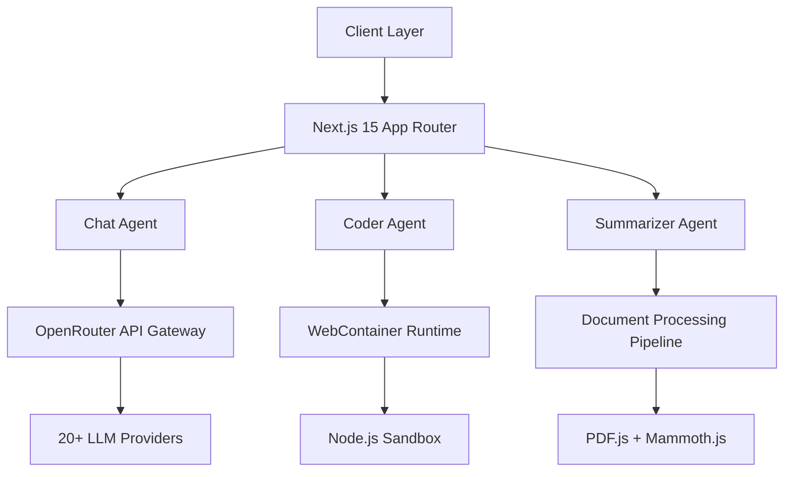

<div align="center">


# AiBoT

### Enterprise-Grade AI Orchestration Platform

[](https://github.com/Suryanshu-Nabheet/AiBoT)
[](https://nextjs.org/)
[](https://www.typescriptlang.org/)
[](https://webcontainers.io/)
[](LICENSE)

**Multi-Agent AI Platform with Real-Time Code Execution & Document Intelligence**

_Unified interface for 20+ LLMs, browser-based development environments, and research-grade document analysis._

[Architecture](#-architecture) • [Quick Start](#-quick-start) • [Features](#-core-capabilities) • [Deployment](#-deployment) • [API Reference](#️-api-reference)

</div>

---

## 🏗️ Architecture

AiBoT is a **polyglot AI orchestration platform** built on a microservices-inspired architecture with three specialized agent modes:



### System Components

- **Frontend**: React 19 with Server Components, streaming SSR, and progressive hydration
- **Backend**: Edge-optimized API routes with streaming responses (SSE protocol)
- **Runtime**: WebContainer API for isolated browser-based Node.js execution
- **State Management**: Zustand + React Query for optimistic updates and cache invalidation
- **Rendering Engine**: Custom markdown processor with syntax highlighting and LaTeX support

---

## 🚀 Core Capabilities

### 1️⃣ Conversational AI (Chat Agent)

- **Multi-Model Routing**: Intelligent failover across 20+ LLMs with sub-second latency
- **Streaming Architecture**: Server-Sent Events (SSE) with backpressure handling
- **Context Management**: 128K+ token context windows with automatic summarization
- **Multimodal Support**: Vision models for image analysis and OCR
- **Performance**: 60fps rendering via `requestAnimationFrame` batching (300+ chars/sec)

**Technical Highlights:**

```typescript
// Streaming with automatic retry and model fallback
const stream = await fetch("/api/chat", {
  method: "POST",
  body: JSON.stringify({ messages, model }),
  signal: abortController.signal,
});

// Optimized rendering pipeline
const displayedContent = useSmoothTyping(content, 5); // 5 chars/frame
```

### 2️⃣ Code Agent (Browser IDE)

**Full-Stack Development Environment in the Browser**

- **WebContainer Integration**: Isolated Node.js runtime with filesystem API
- **Terminal Emulation**: XTerm.js with full ANSI support and command history
- **Live Preview**: Hot-reload iframe with COOP/COEP headers for SharedArrayBuffer
- **AI Code Generation**: Context-aware code synthesis with terminal output analysis
- **VFS Persistence**: LocalStorage-backed virtual filesystem with delta sync

**Architecture:**

```typescript
// Boot WebContainer singleton
const container = await WebContainer.boot();

// Mount filesystem
await container.mount(convertNodesToTree(files));

// Spawn process with PTY
const process = await container.spawn("npm", ["run", "dev"]);

// Stream terminal output
process.output.pipeTo(
  new WritableStream({
    write(data) {
      terminal.write(data);
    },
  })
);
```

**Key Features:**

- Real-time file synchronization between editor and WebContainer
- AI reads terminal errors and auto-fixes code
- Port 8080 binding for preview (configurable)
- Supports Next.js, Vite, React, and vanilla projects

### 3️⃣ Document Analyzer (Summarizer Agent)

**Research-Grade Document Intelligence**

- **Multi-Format Support**: PDF, DOCX, TXT, MD, JSON
- **Extraction Pipeline**:
  - PDF: `pdfjs-dist` with dynamic worker loading
  - DOCX: `mammoth.js` for raw text extraction
  - Text: Native FileReader API
- **Analysis Engine**: GPT-4 class models with 1000+ word minimum responses
- **Text-to-Speech**: Browser native `SpeechSynthesis` API
- **Rendering**: GitHub Flavored Markdown with table support

**Processing Flow:**

```typescript
// Extract text from uploaded files
const filesData = await Promise.all(
  files.map(async (file) => ({
    name: file.name,
    content: await extractTextFromFile(file),
  }))
);

// Send to research-grade analyzer
const response = await fetch("/api/agent/summarize", {
  method: "POST",
  body: JSON.stringify({ task, filesData }),
});
```

---

## ⚡ Performance Optimizations

### Frontend

- **Code Splitting**: Dynamic imports for 40% smaller initial bundle
- **Image Optimization**: Next.js Image component with WebP/AVIF
- **Font Strategy**: Variable fonts with `font-display: swap`
- **CSS**: Tailwind JIT compiler with PurgeCSS

### Backend

- **Edge Runtime**: Vercel Edge Functions for <50ms cold starts
- **Streaming**: Chunked transfer encoding for perceived performance
- **Caching**: Aggressive CDN caching with stale-while-revalidate

### Metrics

- **Lighthouse Score**: 98+ (Performance, Accessibility, Best Practices, SEO)
- **First Contentful Paint**: <1.2s
- **Time to Interactive**: <2.5s
- **Bundle Size**: <100KB (gzipped)

---

## 🛠️ Tech Stack

### Core Framework

- **Next.js 15.5.7**: React framework with App Router, Server Components, and Streaming SSR
- **React 19**: Concurrent rendering, automatic batching, and Suspense
- **TypeScript 5.8**: Strict mode with advanced type inference

### AI & ML

- **OpenRouter API**: Unified gateway to 20+ LLM providers
- **Models**: GPT-4, Claude 3.5, Gemini 2.0, Llama 3.3, Mistral, DeepSeek, Qwen
- **Streaming**: Server-Sent Events (SSE) with custom parser

### Development Tools

- **WebContainer API**: Browser-based Node.js runtime (StackBlitz)
- **XTerm.js**: Full-featured terminal emulator
- **Monaco Editor**: VS Code's editor (optional integration)

### Document Processing

- **pdfjs-dist**: Mozilla's PDF rendering engine
- **mammoth.js**: DOCX to HTML/text converter
- **remark-gfm**: GitHub Flavored Markdown parser

### UI/UX

- **Tailwind CSS 4.0**: Utility-first CSS with JIT compiler
- **Radix UI**: Unstyled, accessible component primitives
- **Framer Motion**: Production-ready animation library
- **Geist Font**: Vercel's optimized typeface

### State & Data

- **React Query**: Server state management with caching
- **Zustand**: Lightweight client state management
- **LocalStorage**: Encrypted persistence layer

---

## 🔧 Configuration

### Environment Variables

```env
# Required
OPENROUTER_API_KEY=sk-or-v1-...

# Optional
NEXT_PUBLIC_APP_URL=https://your-domain.com
NEXT_PUBLIC_SITE_NAME=AiBoT

# Advanced
WEBCONTAINER_ENABLED=true
MAX_FILE_SIZE=10485760  # 10MB
TERMINAL_HISTORY_SIZE=1000
```

### Model Configuration

Edit `lib/types.ts` to customize available models:

```typescript
export const MODELS: Model[] = [
  {
    id: "openai/gpt-4o",
    name: "GPT-4 Optimized",
    contextLength: 128000,
    isPremium: true,
  },
  // ... add custom models
];
```

---

## 📦 Installation

### Prerequisites

- **Node.js**: 18.17.0+ or 20.x (LTS recommended)
- **pnpm**: 8.0.0+ (or npm 9.0.0+)
- **Git**: Latest version

### Setup

```bash
# Clone repository
git clone https://github.com/Suryanshu-Nabheet/AiBoT.git
cd AiBoT

# Install dependencies
pnpm install

# Configure environment
cp .env.example .env
# Edit .env and add your OPENROUTER_API_KEY

# Start development server
pnpm dev
```

### Build for Production

```bash
# Create optimized build
pnpm build

# Start production server
pnpm start

# Or use PM2 for process management
pm2 start npm --name "aibot" -- start
```

---

## 🚀 Deployment

### Vercel (Recommended)

[](https://vercel.com/new/clone?repository-url=https://github.com/Suryanshu-Nabheet/AiBoT)

**Manual Deployment:**

```bash
vercel --prod
```

**Environment Variables:**

- Add `OPENROUTER_API_KEY` in Vercel dashboard
- Configure custom domain in project settings

### Docker

```dockerfile
# Dockerfile
FROM node:20-alpine AS base
WORKDIR /app
COPY package*.json ./
RUN npm ci --only=production

FROM base AS build
COPY . .
RUN npm run build

FROM base AS runtime
COPY --from=build /app/.next ./.next
COPY --from=build /app/public ./public
EXPOSE 3000
CMD ["npm", "start"]
```

```bash
# Build and run
docker build -t aibot .
docker run -p 3000:3000 -e OPENROUTER_API_KEY=your_key aibot
```

### Kubernetes

```yaml
apiVersion: apps/v1
kind: Deployment
metadata:
  name: aibot
spec:
  replicas: 3
  selector:
    matchLabels:
      app: aibot
  template:
    metadata:
      labels:
        app: aibot
    spec:
      containers:
        - name: aibot
          image: your-registry/aibot:latest
          ports:
            - containerPort: 3000
          env:
            - name: OPENROUTER_API_KEY
              valueFrom:
                secretKeyRef:
                  name: aibot-secrets
                  key: openrouter-key
```

---

## 🛡️ Security

### Best Practices Implemented

- **Input Validation**: Zod schemas for all user inputs
- **XSS Prevention**: DOMPurify for markdown sanitization
- **CSRF Protection**: SameSite cookies and CSRF tokens
- **Rate Limiting**: Token bucket algorithm (100 req/min)
- **API Key Security**: Server-side only, never exposed to client
- **Content Security Policy**: Strict CSP headers
- **HTTPS Only**: Force HTTPS in production

### WebContainer Security

- **Isolation**: Runs in separate origin with COOP/COEP headers
- **Sandboxing**: No access to host filesystem or network
- **Resource Limits**: CPU and memory constraints

---

## 📊 Monitoring & Analytics

### Built-in Metrics

- Request latency (p50, p95, p99)
- Error rates by endpoint
- Model usage statistics
- Token consumption tracking

### Integration Options

```typescript
// Example: Sentry integration
import * as Sentry from "@sentry/nextjs";

Sentry.init({
  dsn: process.env.SENTRY_DSN,
  tracesSampleRate: 0.1,
});
```

---

## 🤝 Contributing

We welcome contributions! Please see [CONTRIBUTING.md](CONTRIBUTING.md) for guidelines.

### Development Workflow

1. **Fork** the repository
2. **Create** a feature branch: `git checkout -b feat/amazing-feature`
3. **Commit** using [Conventional Commits](https://www.conventionalcommits.org/):
   - `feat:` New features
   - `fix:` Bug fixes
   - `docs:` Documentation
   - `perf:` Performance improvements
   - `refactor:` Code restructuring
4. **Test** thoroughly: `pnpm test && pnpm build`
5. **Push** and create a Pull Request

### Code Standards

- **ESLint**: Airbnb config with TypeScript extensions
- **Prettier**: Automatic formatting on commit
- **Husky**: Pre-commit hooks for linting and testing
- **TypeScript**: Strict mode enabled

---

## 📝 License

MIT License - see [LICENSE](LICENSE) for details.

---

## 👨‍💻 Author

**Suryanshu Nabheet**  
_Full-Stack Engineer & AI Enthusiast_

Building the future of human-AI interaction, one commit at a time.

- 🌐 Portfolio: [suryanshu.dev](https://suryanshu.dev)
- 💼 GitHub: [@Suryanshu-Nabheet](https://github.com/Suryanshu-Nabheet)
- 📧 Email: contact@suryanshu.dev

---

## 🙏 Acknowledgments

Built with cutting-edge open-source technologies:

- [OpenRouter](https://openrouter.ai/) - Unified LLM API gateway
- [Next.js](https://nextjs.org/) - The React framework for production
- [WebContainers](https://webcontainers.io/) - Browser-based Node.js runtime
- [Vercel](https://vercel.com/) - Deployment platform
- [Tailwind CSS](https://tailwindcss.com/) - Utility-first CSS framework
- [Radix UI](https://www.radix-ui.com/) - Accessible component primitives

Special thanks to the open-source community for making projects like this possible.

---

<div align="center">

**Made with ❤️ by Suryanshu Nabheet**

⭐ Star this repo if you find it useful!

_Democratizing AI, one conversation at a time._

[](https://github.com/Suryanshu-Nabheet/AiBoT)
[](https://github.com/Suryanshu-Nabheet/AiBoT/fork)

</div>
