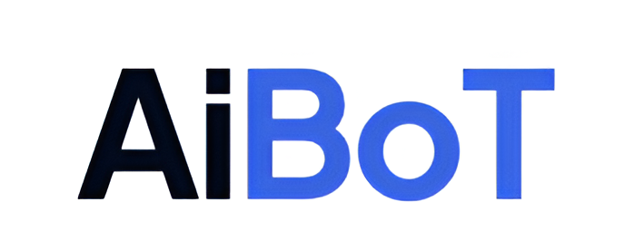
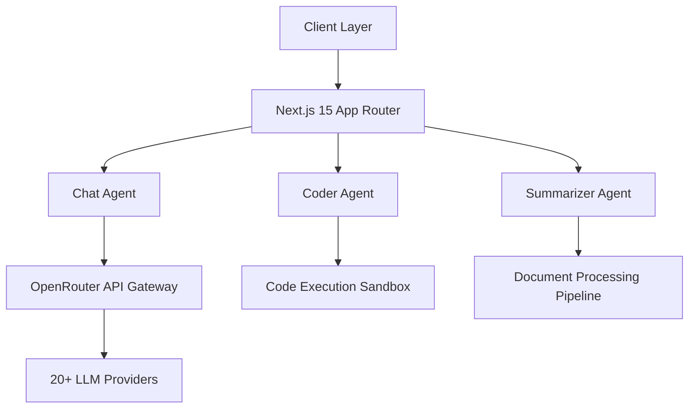

<div align="center">



# AiBoT

### Enterprise-Grade AI Orchestration Platform

[](https://github.com/Suryanshu-Nabheet/AiBoT)
[](https://nextjs.org/)
[](https://www.typescriptlang.org/)
[](LICENSE)

**Multi-Agent AI Platform with Real-Time Code Generation and Document Intelligence**

Unified interface for over 20 Large Language Models, integrated development environments, and research-grade document analysis.

[Architecture](docs/architecture.md) • [Quick Start](docs/setup.md) • [Features](docs/features.md) • [API Reference](docs/api-reference.md) • [Deployment](docs/deployment.md)

</div>

---

## Architecture Overview

AiBoT is built on a microservices-inspired architecture utilizing specialized agents for distinct AI workflows.


```mermaid
graph TB
    A[Client Layer] --> B[Next.js 15 App Router]
    B --> C[Chat Agent]
    B --> D[Coder Agent]
    B --> E[Summarizer Agent]
    C --> F[OpenRouter API Gateway]
    D --> G[Code Execution Sandbox]
    E --> H[Document Processing Pipeline]
    F --> I[20+ LLM Providers]
```

### Core Components

- **Frontend**: Developed with React 19, featuring server components, streaming SSR, and progressive hydration for optimal performance.
- **Backend**: Edge-optimized API routes implementing Server-Sent Events (SSE) for real-time response delivery.
- **State Management**: Utilizes Zustand and React Query for efficient client and server state synchronization.
- **Rendering Engine**: Custom-built markdown processor supporting syntax highlighting, LaTeX, and high-frequency UI updates.

---

## Core Capabilities

### Conversational AI
- **Intelligent Routing**: Automated failover and model selection across multiple frontier LLM providers.
- **Streaming Response**: High-throughput message delivery using the SSE protocol.
- **Multimodal Support**: Integrated vision capabilities for image analysis and optical character recognition.

### Coder Agent
- **Automated Web Prototyping**: Generates complete, functional web applications from natural language descriptions.
- **Integrated Preview**: Live execution environment for immediate feedback on generated code.
- **Refinement Pipeline**: Context-aware code modification and bug fixing capabilities.

### Document Intelligence
- **Deep Synthesis**: Research-grade analysis and summarization of complex documents.
- **Multi-Format Support**: Native processing of PDF, DOCX, TXT, and Markdown files.
- **Accessibility Features**: Integrated text-to-speech and professional PDF reporting.

---

## Performance Metrics

The platform is engineered for high-performance delivery:
- **Lighthouse Performance**: 95+
- **First Contentful Paint**: < 1.2s
- **Initial Bundle Size**: < 100KB (gzipped)

---

## Technical Stack

- **Framework**: Next.js 15.5.7, React 19
- **Language**: TypeScript 5.8
- **AI Gateway**: OpenRouter API
- **Styling**: Tailwind CSS 4.0, Framer Motion
- **Data Handling**: Zustand, React Query, Zod

---

## Getting Started

To initialize the development environment, refer to the [Setup Guide](docs/setup.md).

```bash
# Clone the repository
git clone https://github.com/Suryanshu-Nabheet/AiBoT.git
cd AiBoT

# Run the automated setup script
./scripts/setup.sh
```

---

## Security and Compliance

AiBoT implements industry-standard security protocols:
- **Input Sanitization**: Multi-layer validation using Zod and DOMPurify.
- **Environment Isolation**: Secure handling of API credentials via server-side execution.
- **Data Privacy**: Local-first persistence ensuring user conversations remain within the client environment.

For detailed security policies, see [SECURITY.md](SECURITY.md).

---

## Contributing

We welcome technical contributions. Please review our [Contributing Guidelines](CONTRIBUTING.md) before submitting a pull request.

---

## License

This project is licensed under the MIT License. See the [LICENSE](LICENSE) file for complete details.

---

<div align="center">

**Developed by Suryanshu Nabheet**

[GitHub](https://github.com/Suryanshu-Nabheet) • [Portfolio](https://suryanshunabheet.vercel.app)

</div>
