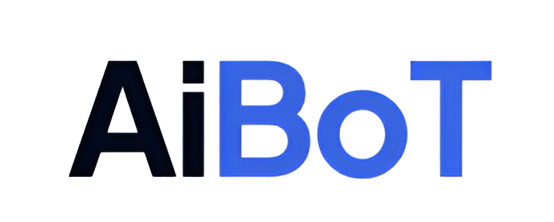
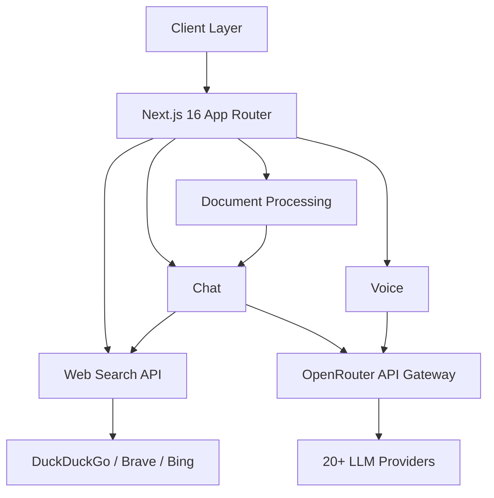

<div align="center">



# AiBoT

### Enterprise-Grade AI Orchestration Platform

[](https://github.com/Suryanshu-Nabheet/AiBoT)
[](https://nextjs.org/)
[](https://www.typescriptlang.org/)
[](LICENSE)

**Multi-Model AI Assistant for Conversations, Web Search, Voice, and Document Intelligence**

Unified interface for over 20 Large Language Models, optional grounded web search, multimodal conversations, voice interaction, and document analysis.

[Architecture](docs/architecture.md) • [Quick Start](docs/setup.md) • [Features](docs/features.md) • [Web Search](docs/web-search.md) • [API Reference](docs/api-reference.md) • [Deployment](docs/deployment.md)

</div>

---

## Architecture Overview

AiBoT combines streaming chat, web search, document analysis, and voice conversations in one interface.


```mermaid
graph TB
    A[Client Layer] --> B[Next.js 16 App Router]
    B --> C[Chat]
    B --> D[Document Processing]
    B --> E[Voice]
    B --> W[Web Search API]
    W --> S[DuckDuckGo / Brave / Bing]
    C --> W
    C --> F[OpenRouter API Gateway]
    D --> C
    E --> F
    F --> I[20+ LLM Providers]
```

### Core Components

- **Frontend**: Developed with React 19, featuring server components, streaming SSR, and progressive hydration for optimal performance.
- **Backend**: Edge-optimized API routes implementing Server-Sent Events (SSE) for real-time response delivery.
- **Web search**: Keyless server-side search with trace UI, favicon proxy, and context injection before each model turn.
- **State Management**: Uses React Context and React Query for client and server state synchronization.
- **Rendering Engine**: Custom-built markdown processor supporting syntax highlighting, LaTeX, and high-frequency UI updates.

---

## Core Capabilities

### Conversational AI

- **Intelligent Routing**: Automated failover and model selection across multiple frontier LLM providers.
- **Streaming Response**: High-throughput message delivery using the SSE protocol.
- **Multimodal Support**: Integrated vision capabilities for image analysis and optical character recognition.
- **Thinking mode**: Optional extended reasoning before the visible answer.
- **Web search**: Optional pre-reply search with sources, collapsible trace, and URL-grounded context ([guide](docs/web-search.md)).

### Document Work in Chat

- **Multi-Format Support**: Attach PDFs, Office documents, spreadsheets, images, videos, and text files in any regular conversation.
- **Structured Answers**: Ask for briefs, notes, research synthesis, spreadsheet analysis, or follow-up questions using the same chat history.
- **Response Actions**: Listen to document answers, copy them, or download them as PDF without leaving the conversation.

---

## Technical Stack

- **Framework**: Next.js 16, React 19
- **Language**: TypeScript 5.8
- **AI Gateway**: OpenRouter API
- **Web search**: Server-side HTML providers (DuckDuckGo, Brave, Bing fallbacks)
- **Styling**: Tailwind CSS 4.0, Framer Motion
- **Data Handling**: React Context, React Query, Zod

---

## Getting Started

To initialize the development environment, refer to the [Setup Guide](docs/setup.md).

```bash
# Clone the repository
git clone https://github.com/Suryanshu-Nabheet/AiBoT.git
cd AiBoT

# Run the automated setup script
./scripts/setup.sh
```

Enable **Web search** in the composer model menu to try grounded lookups locally (no extra API keys beyond OpenRouter).

---

## Security and Compliance

AiBoT implements industry-standard security protocols:

- **Input Validation**: Server-side request schemas and payload limits.
- **Environment Isolation**: Secure handling of API credentials via server-side execution.
- **Rate Limiting**: Scoped limits on chat, web search, and favicon routes.
- **Data Privacy**: Local-first persistence ensuring user conversations remain within the client environment.

For detailed security policies, see [SECURITY.md](SECURITY.md).

---

## Contributing

We welcome technical contributions. Please review our [Contributing Guidelines](CONTRIBUTING.md) before submitting a pull request.

---

## License

This project is licensed under the MIT License. See the [LICENSE](LICENSE) file for complete details.

---

<div align="center">

**Developed by Suryanshu Nabheet**

[GitHub](https://github.com/Suryanshu-Nabheet) • [Portfolio](https://suryanshunabheet.vercel.app)

</div>
