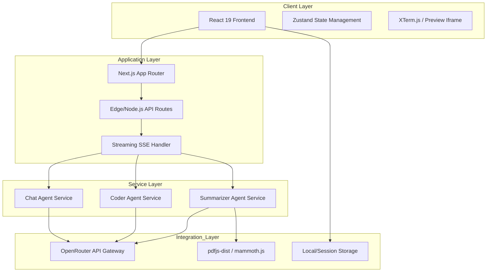

# System Architecture

This document provides a technical overview of the AiBoT platform architecture, detailing the frontend, backend, and specialized agent layers.

## System Overview

AiBoT is built as a modern web application leveraging the Next.js 15 framework. It utilizes a microservices-inspired internal architecture where specialized agents handle distinct categories of AI tasks: Conversational AI, Automated Coding, and Document Intelligence.

## Frontend Architecture

The frontend is developed using React 19 and Next.js 15, focusing on performance and responsiveness.

### Core Technologies
- **Next.js 15 (App Router)**: Enables server-side rendering (SSR), streaming, and optimized client-side navigation.
- **React 19**: Utilizes concurrent rendering and the latest hook patterns for efficient UI updates.
- **Tailwind CSS 4.0**: Provides a robust, utility-first styling system for rapid UI development and consistent design language.
- **Framer Motion**: Manages complex animations and transitions for a premium user experience.
- **Lucide & Phosphor Icons**: Integrated icon sets for a clean and professional interface.

### State Management
- **Zustand**: Used for lightweight, reactive client-side state management.
- **React Query (TanStack Query)**: Manages server state, caching, and optimistic updates for data fetching operations.
- **Context API**: Employed for cross-cutting concerns like execution context and view mode management.

## Backend Architecture

The backend consists of serverless-ready API routes hosted within the Next.js environment.

### API Layer
- **Standardized Endpoints**: Located in `app/api/`, these endpoints handle requests from the frontend agents.
- **Streaming Responses**: Implements Server-Sent Events (SSE) to provide real-time AI responses, reducing perceived latency.
- **Input Validation**: Uses Zod for schema validation on all incoming requests.

### AI Integration
- **OpenRouter Gateway**: A unified interface to communicate with multiple Large Language Model (LLM) providers.
- **System Prompt Engineering**: Dynamic prompt generation based on the selected model and agent type to optimize response quality.
- **Model-Specific Handling**: Includes logic to manage differences in model capabilities, such as system role support and multimodal input formats.

## Agent Architecture

### Chat Agent
Handles general-purpose conversations. It features model-switching capabilities and supports vision-based interactions by processing image attachments.

### Coder Agent
Designed for rapid web prototyping. It generates complete HTML/CSS/JS code blocks and provides a live preview environment using an isolated iframe.

### Summarizer Agent
Specializes in document analysis. It utilizes a processing pipeline to extract text from various file formats (PDF, DOCX, etc.) before sending the structured data to the LLM for research-grade synthesis.

## Data Flow

1. **User Input**: The user interacts with the frontend (e.g., enters a prompt or uploads a file).
2. **State Update**: Local state is updated, and the request is prepared.
3. **API Call**: The frontend sends a POST request to the corresponding `/api/` endpoint.
4. **Backend Processing**: The backend validates input, prepares the system prompt, and initiates a streaming request to OpenRouter.
5. **Streaming Output**: The AI response is streamed back to the frontend in real-time.
6. **UI Rendering**: The frontend parses the stream and updates the display using optimized rendering techniques (e.g., smooth typing hooks).
7. **Persistence**: The interaction is saved to local or session storage for future reference.
