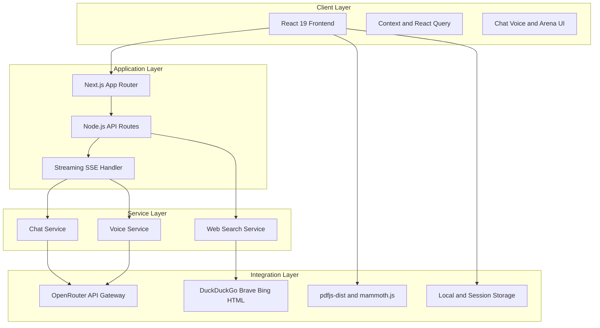
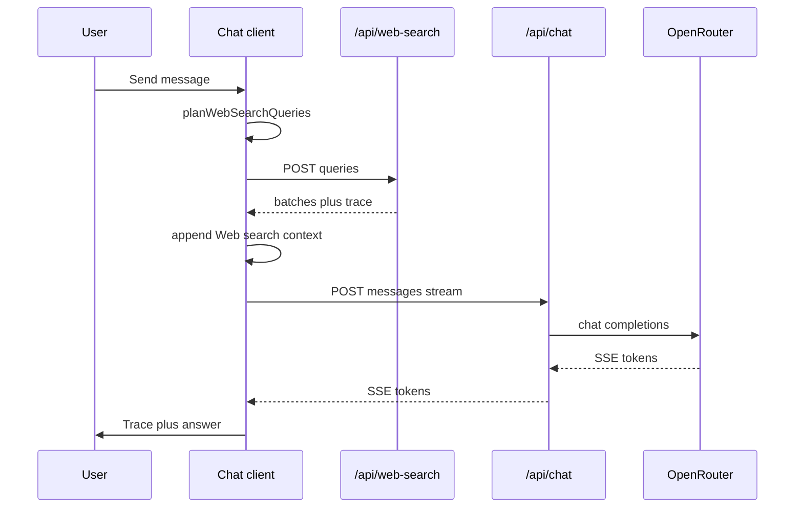

# System Architecture

This document provides a technical overview of the AiBoT platform architecture, detailing its frontend, backend, and independent product features.

## System Overview

AiBoT is built as a modern web application using the Next.js 16 framework. Chat, document work, web search, and Voice are independent experiences supported by shared model routing and provider services.

```mermaid
graph TB
    subgraph Client_Layer [Client Layer]
        A[React 19 Frontend]
        B[Context and React Query]
        C[Chat Voice and Arena UI]
    end

    subgraph Application_Layer [Application Layer]
        D[Next.js App Router]
        E[Node.js API Routes]
        F[Streaming SSE Handler]
    end

    subgraph Service_Layer [Service Layer]
        G[Chat Service]
        H[Voice Service]
        W[Web Search Service]
    end

    subgraph Integration_Layer [Integration Layer]
        J[OpenRouter API Gateway]
        K[pdfjs-dist and mammoth.js]
        S[DuckDuckGo Brave Bing HTML]
        L[Local and Session Storage]
    end

    A --> D
    A --> K
    D --> E
    E --> F
    E --> W
    W --> S
    F --> G
    G --> J
    F --> H
    H --> J
    A --> L
```

## Frontend Architecture

The frontend is developed using React 19 and Next.js 16, focusing on performance and responsiveness.

### Core Technologies

- **Next.js 16 (App Router)**: Enables server-side rendering (SSR), streaming, and optimized client-side navigation. AiBoT retains Webpack for its validated local build path.
- **React 19**: Utilizes concurrent rendering and the latest hook patterns for efficient UI updates.
- **Tailwind CSS 4.0**: Provides a robust, utility-first styling system for rapid UI development and consistent design language.
- **Framer Motion**: Manages complex animations and transitions for a premium user experience.
- **Lucide & Phosphor Icons**: Integrated icon sets for a clean and professional interface.

### State Management

- **React Query (TanStack Query)**: Manages server state, caching, and optimistic updates for data fetching operations.
- **Context API**: Employed for cross-cutting concerns like execution context, settings, and view mode management.
- **Local storage hooks**: Persist model choice, thinking mode, and web search toggle (`use-web-search-mode`, `use-thinking-mode`).

## Backend Architecture

The backend consists of serverless-ready API routes hosted within the Next.js environment.

### API Layer

- **Standardized Endpoints**: Located in `app/api/`, these endpoints handle requests from each frontend experience.
- **Streaming Responses**: Implements Server-Sent Events (SSE) to provide real-time AI responses, reducing perceived latency.
- **Input Validation**: Uses Zod for schema validation on all incoming requests.
- **Request security**: Rate limiting and scope checks on chat, web search, and favicon routes.

### AI Integration

- **OpenRouter Gateway**: A unified interface to communicate with multiple Large Language Model (LLM) providers.
- **System Prompt Engineering**: Dynamic prompt generation based on the selected model and active experience.
- **Model-Specific Handling**: Includes logic to manage differences in model capabilities, such as system role support and multimodal input formats.

## Product Services

### Chat

Handles general-purpose conversations. It features model-switching capabilities, optional **thinking** stages, optional **web search** pre-steps, and vision-based interactions by processing image attachments.

### Web Search

When enabled for a turn, the client:

1. Plans 1–2 queries from the user message (`lib/web-search/query.ts`).
2. Calls `POST /api/web-search` (`lib/server/web-search/search.ts`).
3. Builds a trace for the UI (`lib/web-search/trace.ts`) and context text for the model (`lib/web-search/context.ts`).
4. Streams the assistant reply via `/api/chat` with enriched user content.

Traces are stored on `Message.webSearchTrace` and normalized when conversations are loaded from storage. Details: [Web Search](web-search.md).

### Voice

Provides spoken input and audio responses through the configured model provider at `/api/voice`.

### Document Work in Chat

The chat composer extracts supported documents and media into normalized attachments. The chat session sends those attachments through the same streaming endpoint as text prompts and preserves them in conversation history for grounded follow-ups.

## Data Flow

### Standard chat turn

1. **User Input**: The user enters a prompt (and optional attachments).
2. **State Update**: Local state is updated; optional web search runs before the chat request.
3. **API Call**: The frontend sends a POST request to `/api/chat` (user content may include web search context).
4. **Backend Processing**: The backend validates input, prepares the system prompt, and initiates a streaming request to OpenRouter.
5. **Streaming Output**: The AI response is streamed back to the frontend in real-time.
6. **UI Rendering**: The frontend parses the stream and updates the display (including web search trace on the assistant bubble).
7. **Persistence**: Messages and traces are saved via conversation snapshot persistence.

### Web search turn (when enabled)

```mermaid
sequenceDiagram
    participant U as User
    participant C as Chat client
    participant WS as /api/web-search
    participant CH as /api/chat
    participant OR as OpenRouter

    U->>C: Send message
    C->>C: planWebSearchQueries
    C->>WS: POST queries
    WS-->>C: batches plus trace
    C->>C: append Web search context
    C->>CH: POST messages stream
    CH->>OR: chat completions
    OR-->>CH: SSE tokens
    CH-->>C: SSE tokens
    C->>U: Trace plus answer
```
